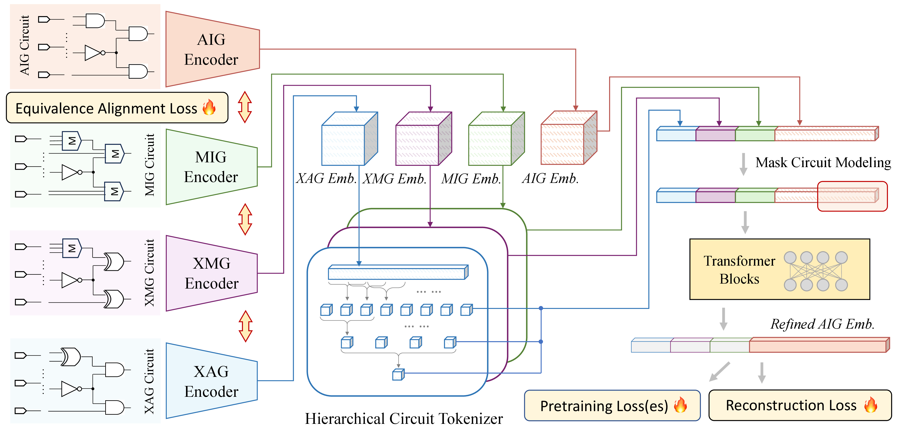

# Alignment Unlocks Complementarity: A Framework for Multiview Circuit Representation Learning

## Abstract
Multiview learning on Boolean circuits holds immense promise, as different graph-based representations offer complementary structural and semantic information. However, the vast structural heterogeneity between views such as an And-Inverter Graph (AIG) versus an XOR-Majority Graph (XMG)-poses a critical barrier to effective fusion, especially for self-supervised techniques like masked modeling. Naively applying such methods fails, as the cross-view context is perceived as noise. Our key insight is that functional alignment is a necessary precondition to unlock the power of multiview self-supervision. We introduce MixGate, a framework built on a principled training curriculum that first teaches the model a shared, function-aware representation space via an Equivalence Alignment Loss. Only then do we introduce a multiview masked modeling objective, which can now leverage the aligned views as a rich, complementary signal. Extensive experiments, including a crucial ablation study, demonstrate that our alignment-first strategy transforms masked modeling from an ineffective technique into a powerful performance driver.

## 🗺️ Technical Roadmap

### 1. MixGate Overview
MixGate generates multi-view tokens using dedicated graph encoders and a novel hierarchical tokenizer. These are fused by Transformer blocks to produce a refined, feature-enriched embedding.


### 2. Equivalence Alignment
Before masking, MixGate establishes connections between circuits of different modalities by explicitly enforcing functional consistency for equivalent nodes across various views.

### 3. Masked Circuit Modeling (MCM)
Once the latent spaces are aligned, MixGate utilizes an MCM objective where a masked cone in a target view is reconstructed using complementary cross-view context.

## 🚀 Getting Started

### Prerequisites
Ensure you have the required dependencies installed. You will need `torch` and `torchrun` for distributed training.

### 1. Training MixGate (Refining Encoders)
Instead of running separate scripts for every baseline, you can use the generalized `train_mask.py` script. MixGate supports enhancing multiple SOTA encoders. 

**General Command Template:**
```bash
torchrun --nproc_per_node=<NUM_GPUS> --master_port=<PORT> train_mask.py \
    --exp_id <EXPERIMENT_NAME> \
    --batch_size <BATCH_SIZE> \
    --num_epochs <EPOCHS> \
    --mask_ratio <MASK_RATIO> \
    --gpus <GPU_IDS> \
    --hier_tf \
    --aig_encoder <ENCODER_TYPE>
```

**Supported Base Encoders (`--aig_encoder`):**
* `dg2` (DeepGate2)
* `dg3` (DeepGate3)
* `pg` (PolarGate)
* `hoga` (HOGA)
* `gcn` (GCN)

**Example: Pretraining MixGate with DeepGate2**
```bash
torchrun --nproc_per_node=8 --master_port=27710 train_mask.py \
    --exp_id 01_deepgate2_0.03_alignment \
    --batch_size 16 \
    --num_epochs 120 \
    --mask_ratio 0.03 \
    --gpus 0,1,2,3,4,5,6,7 \
    --hier_tf \
    --aig_encoder dg2
```
*(Note: To test the framework without the alignment module, you can append the `--disable_alignment` flag to your command).*

### 2. Resuming MixGate Training
If you need to resume training from a specific checkpoint, use the corresponding checkpoint script for your chosen encoder. For example, with PolarGate:
```bash
torchrun --nproc_per_node=3 --master_port=29918 train_polargate_checkpoint.py \
    --exp_id 01_polargate_0.00 \
    --batch_size 4 \
    --num_epochs 500 \
    --mask_ratio 0.00 \
    --gpus 2,3,4 \
    --hier_tf \
    --aig_encoder pg
```

### 3. Training Original Encoders (Baselines without MixGate)
If you wish to train the original base encoders independently for baseline comparison, use `train_encoder.py`.

**Example: Training Original HOGA Encoder**
```bash
torchrun --nproc_per_node=1 --master_port=29918 train_encoder.py \
    --exp_id 02_origin_hoga \
    --batch_size 4 \
    --gpus 0 \
    --aig_encoder hoga
```